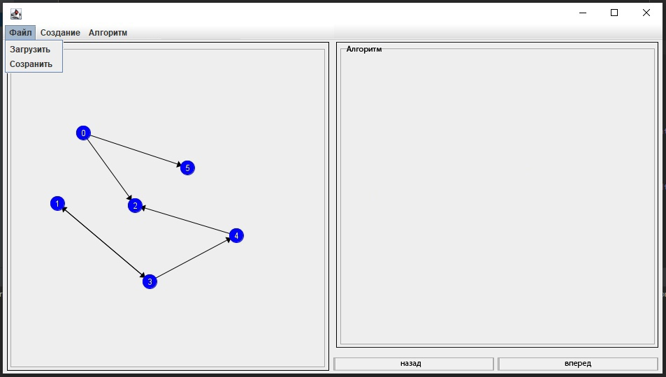
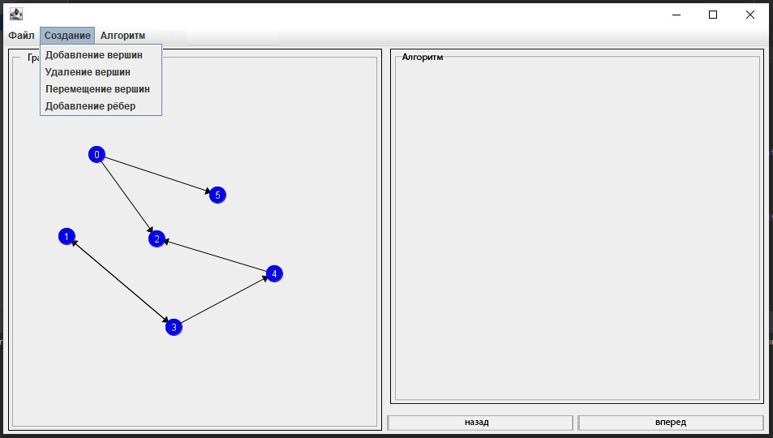
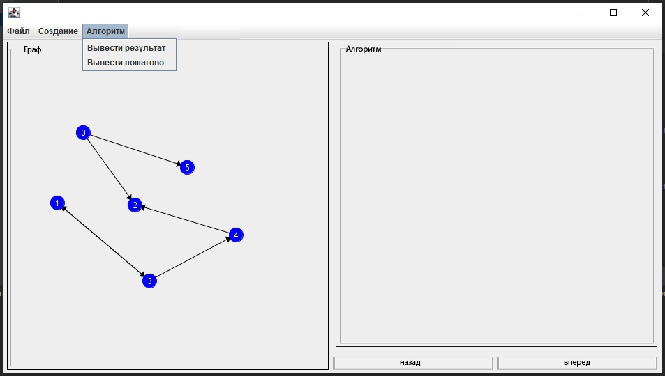

# Топологическая сортировка

## Спецификация

**Прототип интерфейса**

**Диаграмма прецедентов**

**Диаграмма состояний**

## Распределение ролей:
  1. [Николаев Александр](https://github.com/EFFECT322) (9381) - Разработка пользовательского интерфейса отвечающего за создание (Кнопки создания графа, редактирования, работы алгоритма, привязка к этим компонентам функционал). Визуализация графа.
  3. [Прашутинский Кирилл](https://github.com/kirja1980) (9381) - Создание графа, как некоторой структуры данных и реализация самого алгоритма. Визуализация работы алгоритма.

## План разработки:
- [x] Распределение ролей
- [x] Составление спецификации
- [x] Создание прототипа пользовательского интерфейса
- [x] Разработка интерфейса позволяющего построить граф
- [x] **Прототип (06.07.2021)**
- [x] Реализация алгоритма и вывод результата работы алгоритма в приложение
- [x] **1 Итерация (07.07.2021)**
- [x] Добавление возможность пошагового исполнения алгоритма
- [x] Добавление возможности возврата исполнения алгоритма к предыдущим шагам
- [x] Добавление возможности записи/чтения графа из файла
- [x] Тестирование приложения
- [x] **2 Итерация (09.07.2021)**
