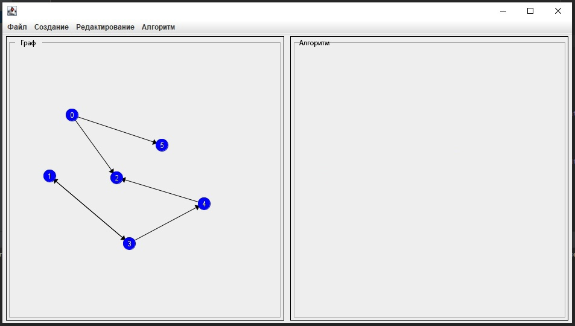
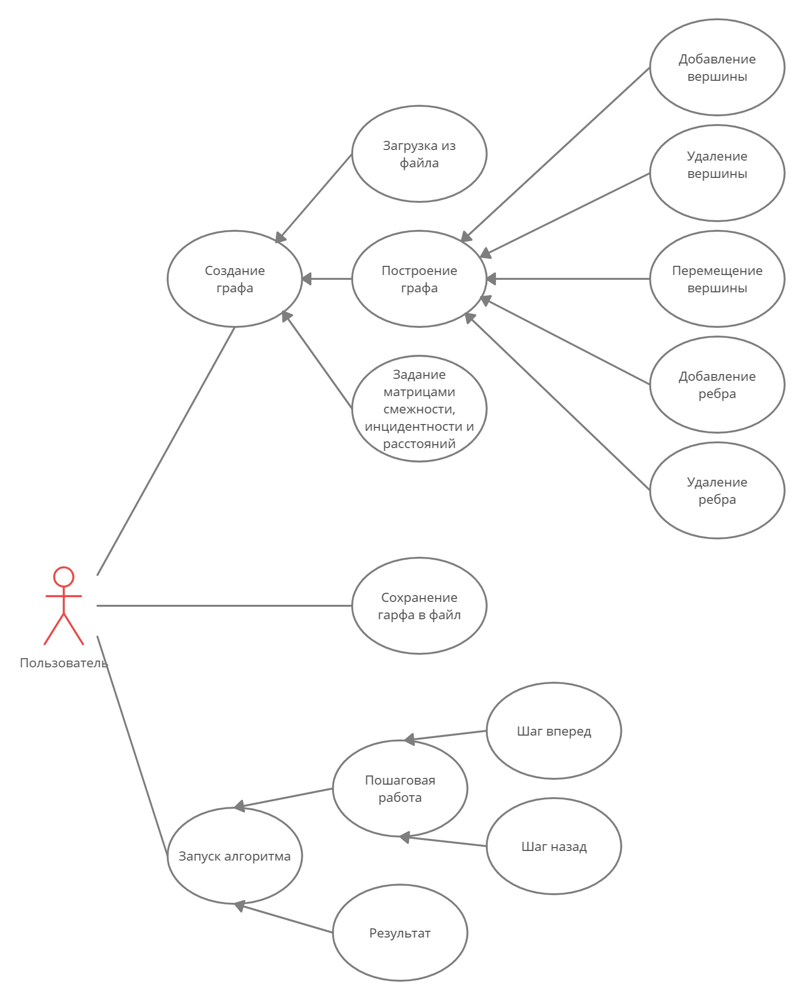
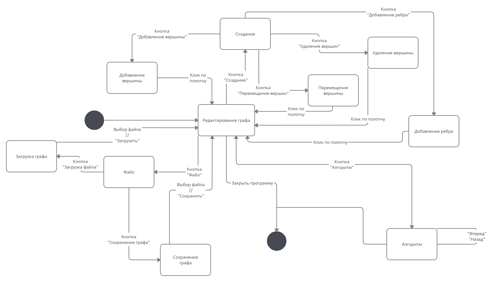

# Топологическая сортировка

## Спецификация

**Прототип интерфейса**

**Диаграмма прецедентов**

**Диаграмма состояний**

## Распределение ролей:
  1. [Николаев Александр](https://github.com/EFFECT322) (9381) - Разработка пользовательского интерфейса отвечающего за создание (Кнопки создания графа, редактирования, работы алгоритма, привязка к этим компонентам функционал). Визуализация графа.
  3. [Прашутинский Кирилл](https://github.com/kirja1980) (9381) - Создание графа, как некоторой структуры данных и реализация самого алгоритма. Визуализация работы алгоритма.

## План разработки:
- [ ] **Прототип (05.07.2021)**
  - [ ] Распределение ролей
  - [ ] Составление спецификации
  - [ ] Создание прототипа пользовательского интерфейса
  - [ ] Разработка интерфейса позволяющего построенить граф
- [ ] **1 Итерация (07.07.2021)**
  - [ ] Реализация алгоритма и вывод результата работы алгоритма в приложение
- [ ] **2 Итерация (09.07.2021)**
  - [ ] Добавление возможность пошагового исполнения алгоритма
  - [ ] Добавление возможности возврата исполнения алгоритма к предыдущим шагам
  - [ ] Добавление возможности записи/чтения графа из файла
  - [ ] Тестирование приложения
